## Red Social - MigrarUnidos

MigrarUnidos es una red social pensada para migrantes de Argentina, Cuba y Venezuela radicados en Chile, y quiénes deseen venir a Chile de manera legal. El objetivo es que se pueda postear información oficial de extranjería, respecto a visas temporales, defintiva, de turismo, experiencias de cada migrante, entre otros. Para ello, se realizó entrevistas a extranjeros dentro y fuera de Chile para determinar la necesidad de crear una red social para tal fin, y de esa forma crear las historias de usuarios. Los resultados preliminares de las entrevistas, concluyeron que existe la necesidad de tener un espacio virtual al cual acudir para aclarar dudas, dar recomendaciones, obtener y ofrecer ayuda con los temas de migración de nuestras nacionalidades. El problema que resuelve el producto, es la desinformación que existe en cuánto al proceso migratorio que debe realizarse para venir a vivir a Chile, a su vez que ayuda a quiénes ya viven aquí. 

# Historias de Usuarios

# HU1
Como Pedro Pérez, quiero entrar a la página de bienvenida para poder registrarme y/o loguearme.

## Criterios de aceptación:

- Quiero ver el nombre y logo de la página.
- Quiero ver una reseña sobre la página.
- Quiero ver la opción para registrarme.
- Quiero iniciar sesión.

## Definición de terminado:

- Estructura básica de la página: nombre, logo, barra y reseña.
- Creación de input para Registro, Olvido de contraseña e Iniciar Sesión.

# HU2
Como Pedro Pérez, quiero registrarme en la Red social para poder acceder a ella.

## Criterios de aceptación:
- Poder ingresar mis datos para registrarme: correo electrónico y contraseña.
- Enviar los datos para completar el registro.

## Definición de terminado:
- Crear input para cada uno de los datos solicitados.
- Al hacer clic en Registrarme, enviar un correo para verficar que el email sea válido.
- Una vez verificado el correo, poder iniciar sesión.

# HU3:
Como Pedro Pérez, quiero loguearme en la página para ver el muro.

## Criterios de aceptación:

- Ingresar con correo electrónico y contraseña o con Google.
- Si los datos son inválidos, poder corregirlos e intentar nuevamente.

## Definición de terminado:

- Validar que los campos no estén vacíos.
- Validar si los datos están en nuestra base de datos.
- Si los datos son válidos, permitir el ingreso a la red social.
- Si los datos no son correctos, que aparezca un mensaje de error, para que el usuario pueda corregirlos.

# HU4:
Como Pedro Pérez, quiero estar en el muro, para crear publicaciones y dar o quitar likes.

## Criterios de aceptación:

- Quiero ver las publicaciones de otros usuarios.
- Quiero poder crear una publicación.
- Quiero dar o poder quitar like.

## Definición de terminado:

- Que cada publicación tenga la identificación del usuario.
- Que al dar clic en el botón crear publicación, que salga un input y un botón submit, para crearla.
- Que al dar clic en el botón de like que se guarde en la base de datos.

# HU5:
Como Pedro Pérez, quiero ver todas mis publicaciones, para poder editarlas y/o eliminarlas.

## Criterios de aceptación:

- Quiero ver todas las publicaciones que he hecho.
- Quiero tener un botón para eliminar la publicación.
- Quiero tener un botón para editar la publicación.

## Definición de terminado:

- Que el usuario pueda tener una sección con todas las publicaciones que ha realizado.
- Que el usuario al dar clic en Eliminar, que aparezca una confirmación para confirmar si desea o no eliminar la publicación.
- Si el usuario elimina la publicación, se borre de la base de datos.
- Que el usuario al dar clic en Editar, aparezca el texto en una campo para editarlo. 

# Prototipos

Para el diseño de nuestro proyecto, realizamos prototipo de baja y alta fidelidad, que mostraremos a continuación.

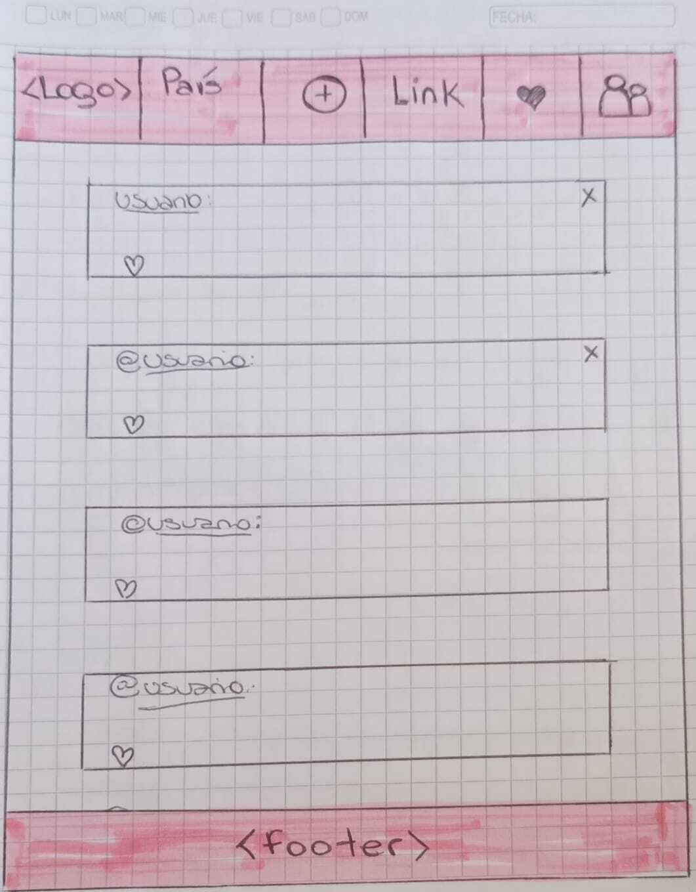

El prototipo de alta fidelidad lo diseñamos en figma, diseñando en primer lugar, la versión para móvil.

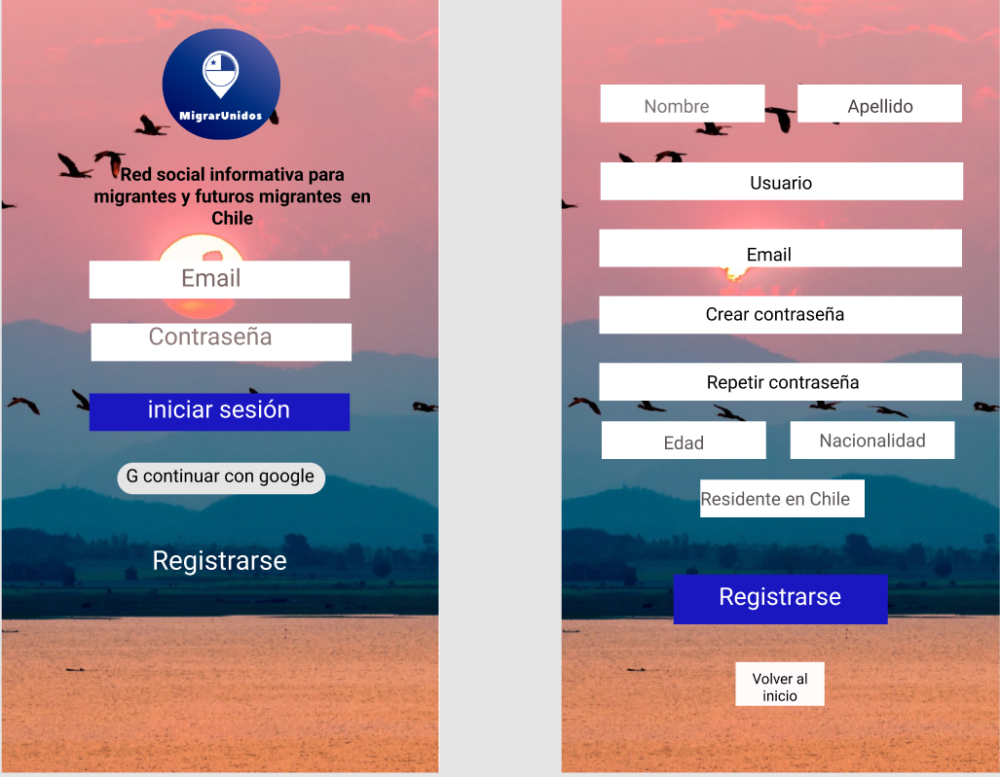

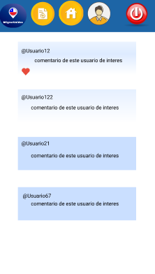

El prototipo de la versión para escritorio, quedó de la siguiente manera:

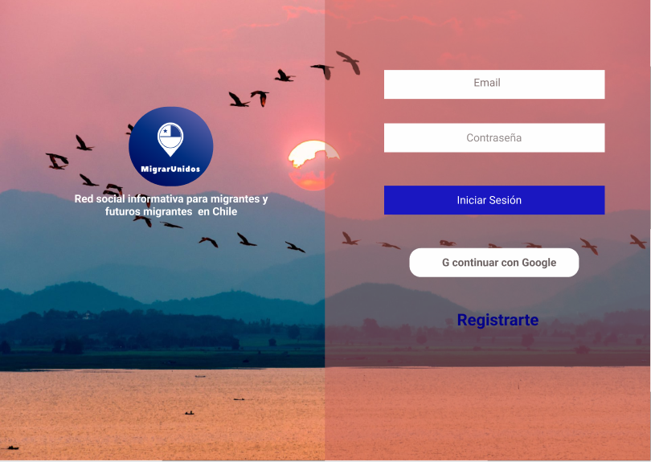

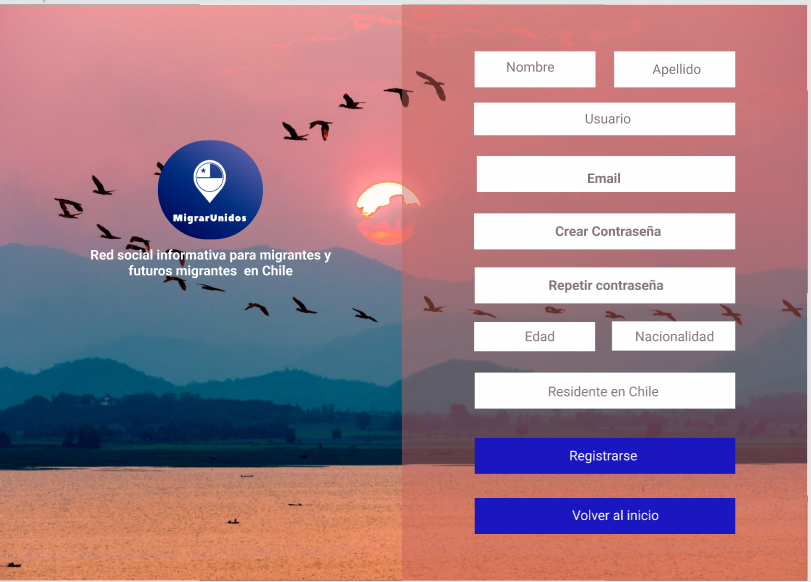

Luego de iterar, el diseño final del proyecto quedó estructurado así:

Versión mobilefirst:

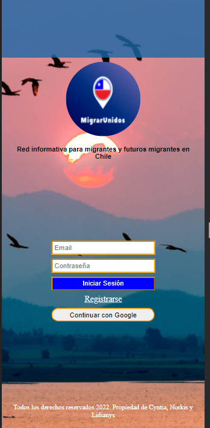

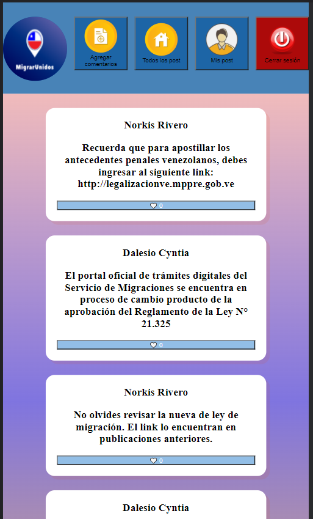

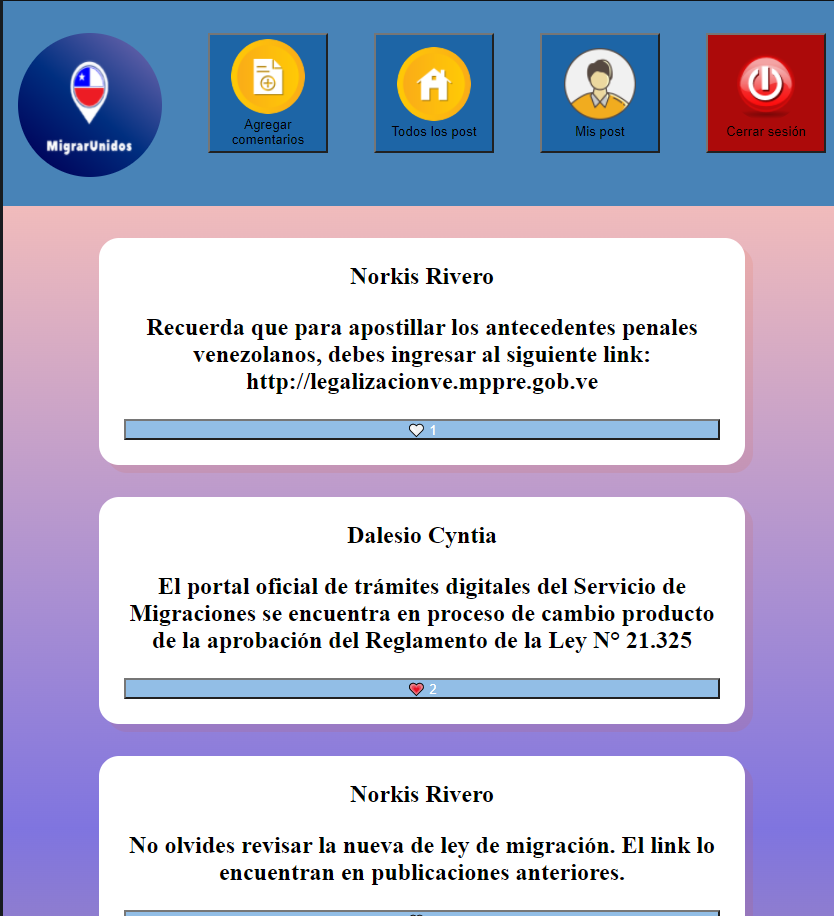

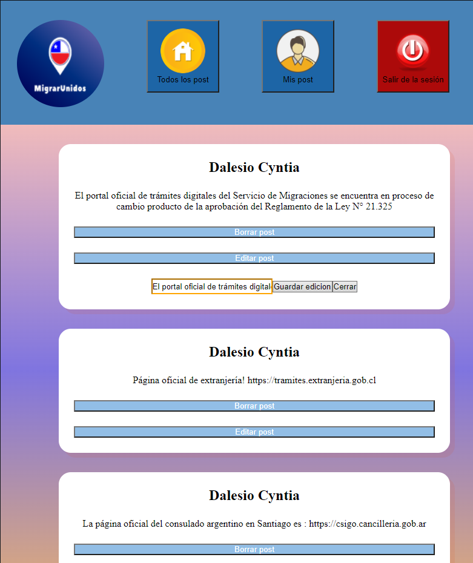

Versión desktop:

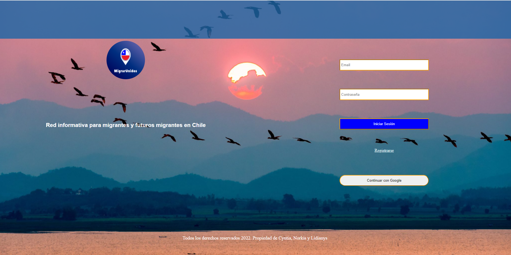

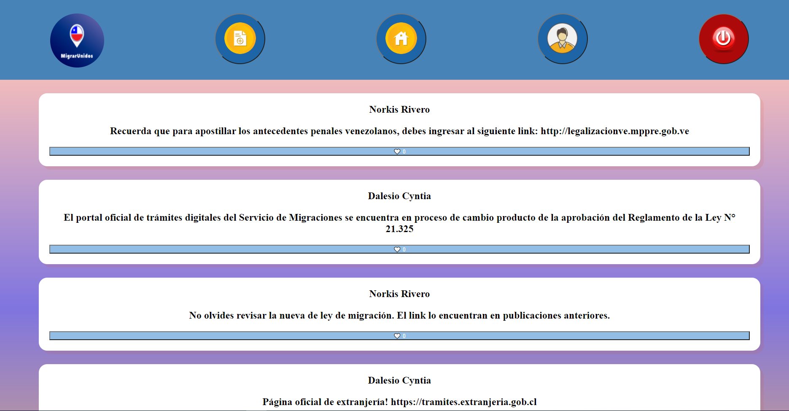

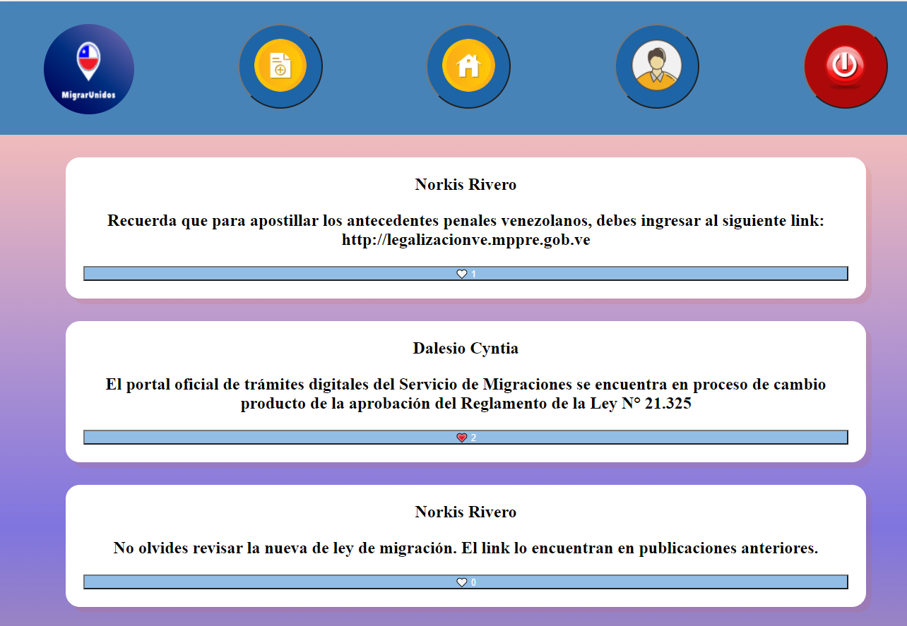

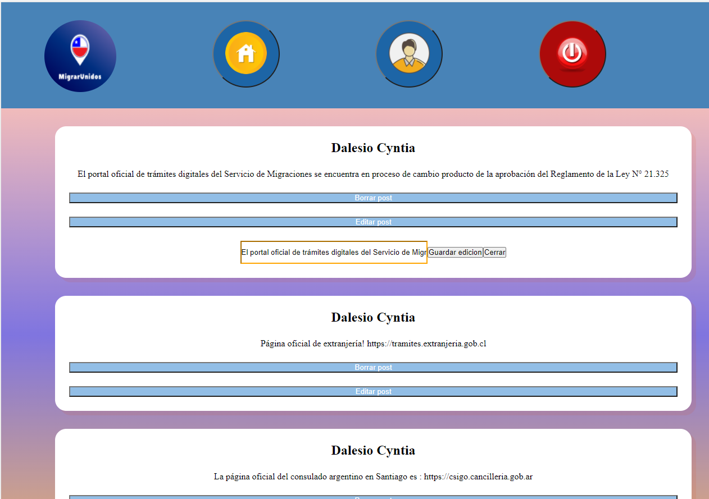

Todos los derechos reservados © 2022.

- Cyntia Dalesio https://github.com/CyntiaDalesio

- Lidianys Rodriguez https://github.com/Lidianys

- Norkis Rivero https://github.com/NorkisRivero
